<!-- This file mirrors the root README so GitHub renders the correct project homepage copy. -->

<p align="center">
  
</p>

> [!NOTE]
> All the code here is LLM-generated or LLM-assisted, but every prompt and agent that ships with Neconyan is human-made.

Neconyan is my cat-themed fork of [SillyTavern](https://github.com/SillyTavern/SillyTavern) and [SillyBunny](https://github.com/SillyBunnyTeam/SillyBunny) for chatting and roleplaying with AI characters, on desktop or your phone. You bring the model, either a local backend or an API key, since no model access or credits come with it.

If you want SillyTavern with everything working exactly like upstream, use [SillyBunny](https://github.com/SillyBunnyTeam/SillyBunny) instead. I only pull in the upstream bits I want, so some things look and behave differently here, and some extensions might not work.

<p align="center">
  
</p>

- **It keeps going when you leave.** Almost everything runs on the server now, so you can send a message on your phone, switch apps or lock the screen, and the reply will be sitting there when you come back. A few things still need the page open, like in-browser WebLLM models and Kokoro voices.
- **It's actually made for phones.** Proper labelled tabs, a bottom chat bar and a sliding menu, not the desktop layout squished down.
- **Four ways to chat.** Classic Roleplay, messenger-style Conversation, a social timeline called Meower, and Story Mode for long-form writing.
- **Story memory.** [Mewmory](../docs/mewmory.md) keeps track of your story, the NPCs you've met and what they said, so you're not re-explaining everything 200 messages later.
- **The good stuff comes built in.** Agents, Chat Archive, Quick Image Gen, Guided Generations, BotSearcher and a few more, each with their own settings. [Here's the full list and who made them.](../docs/neconyan-native-tools.md)
- **Somewhere to keep notes.** [Notebooks](../docs/notebooks.md) gives you space for character drafts, places, scene plans and session journals, right next to your chats. Notes link to each other and to your lorebooks, and the assistants can edit them if you let them.
- **Little helpers.** Miso, Taro and Nori can use tool calls to create characters with portraits, edit lorebooks and adjust presets or agents. The short First paws tour walks you through the basics.
- **It's cute.** Calico themes, cats napping on your messages and a pixel cat on Home. That was the whole point, really.
- **Your files are still your files.** It reads the same character cards, chats, lorebooks and presets as SillyTavern, and there's no telemetry.

<p align="center">
  
</p>

These are staged demo chats and notes with the bundled assistants, so don't read too much into the replies.

### Home

Where you land. Pick a character, start a temporary chat, connect a model or say hi to one of the assistants.

<table>
  <tr>
    <td width="72%">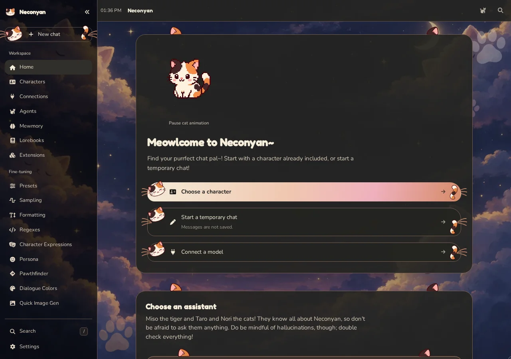</td>
    <td width="28%">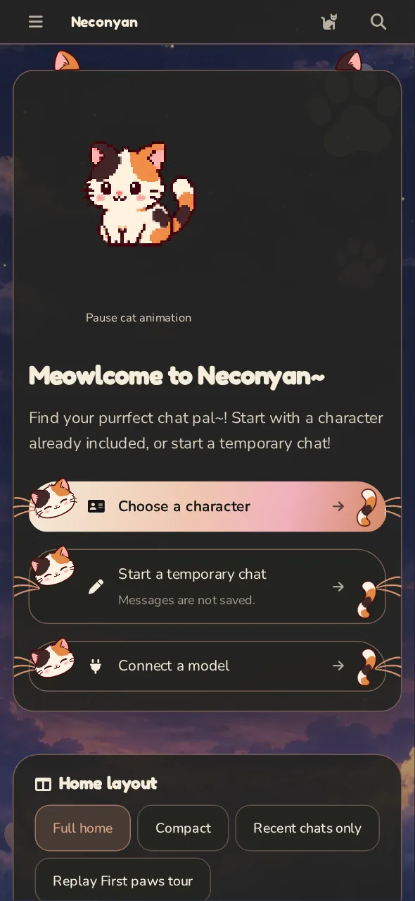</td>
  </tr>
</table>

### Roleplay

The classic chat you know from SillyTavern, with a cat asleep on top of your messages.

<table>
  <tr>
    <td width="72%">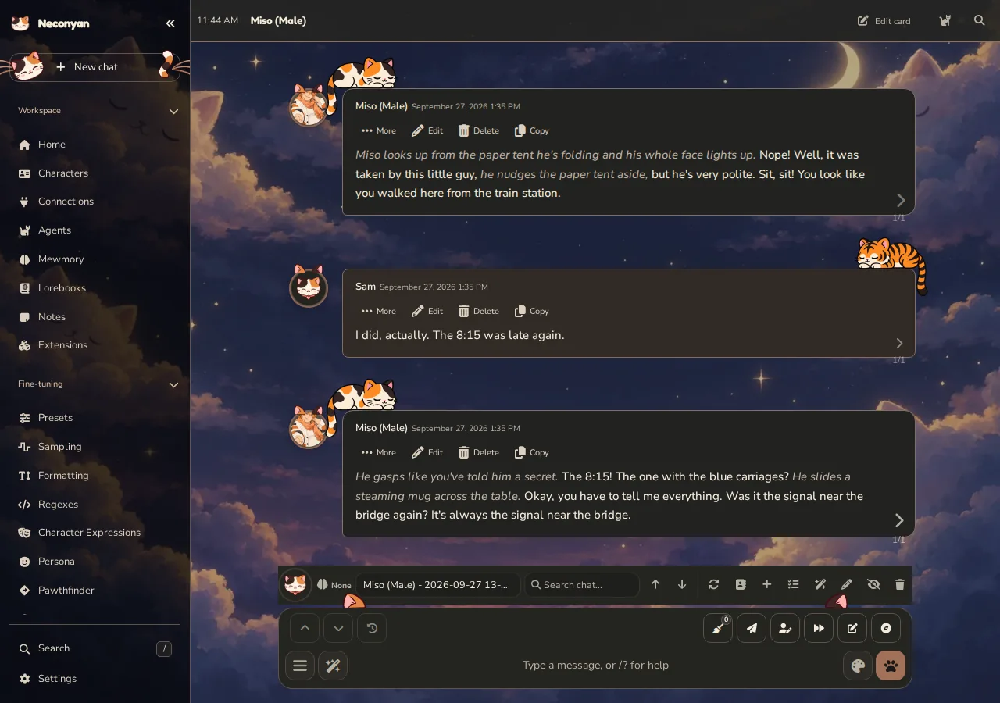</td>
    <td width="28%">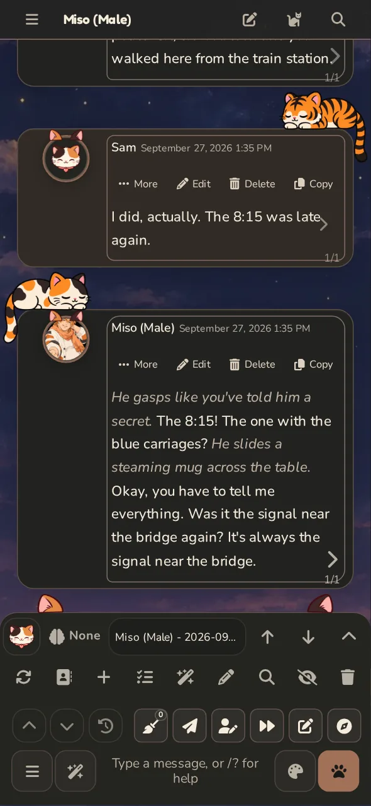</td>
  </tr>
</table>

### Conversation

Texting your characters like you'd text a friend. There's a Pals list, group chats, branches and characters who can be busy or offline.

<table>
  <tr>
    <td width="72%">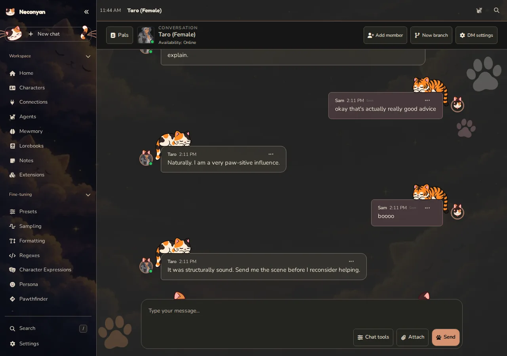</td>
    <td width="28%"></td>
  </tr>
</table>

### Meower

A tiny social timeline where your characters post, reply to each other and run polls about snacks.

<table>
  <tr>
    <td width="72%">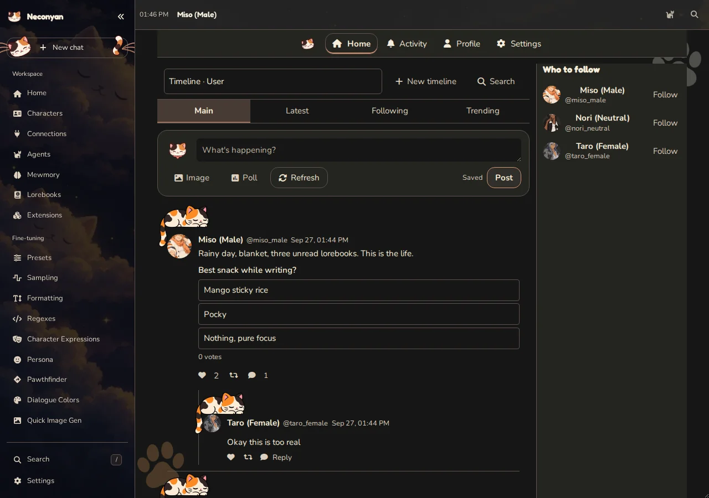</td>
    <td width="28%">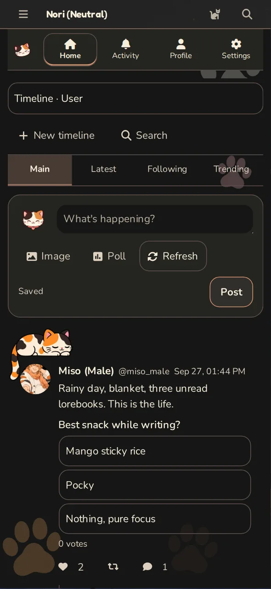</td>
  </tr>
</table>

### Story Mode

The chat turned into continuous prose, for when you'd rather read a story than scroll through bubbles.

<table>
  <tr>
    <td width="72%"></td>
    <td width="28%">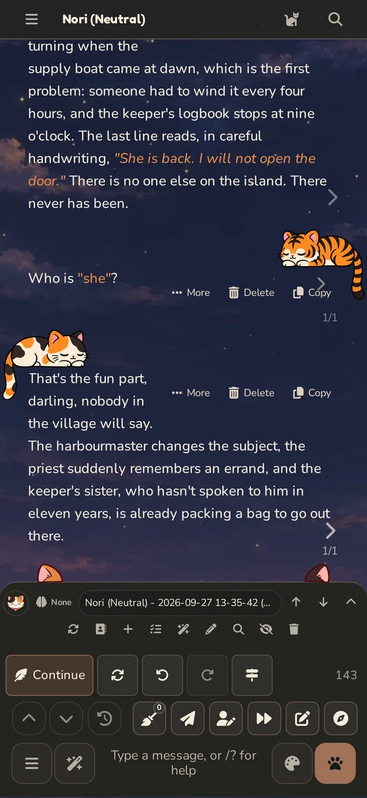</td>
  </tr>
</table>

### Notebooks

A notebook that lives next to your chats, for the character drafts and scene plans you'd otherwise lose in a text file somewhere. It has templates, folders, properties and a read view, and you can open it beside a chat. [More on Notebooks.](../docs/notebooks.md)

<table>
  <tr>
    <td width="72%">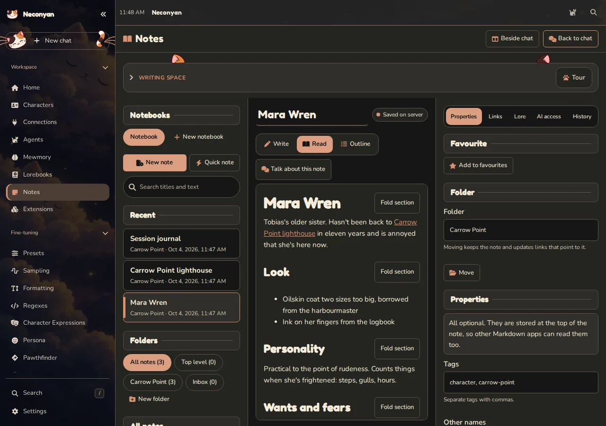</td>
    <td width="28%">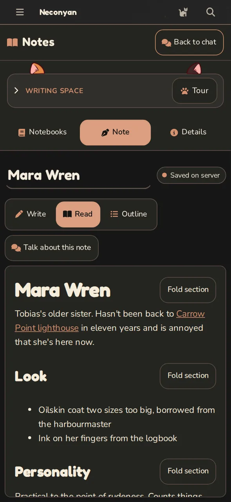</td>
  </tr>
</table>

<p align="center">
  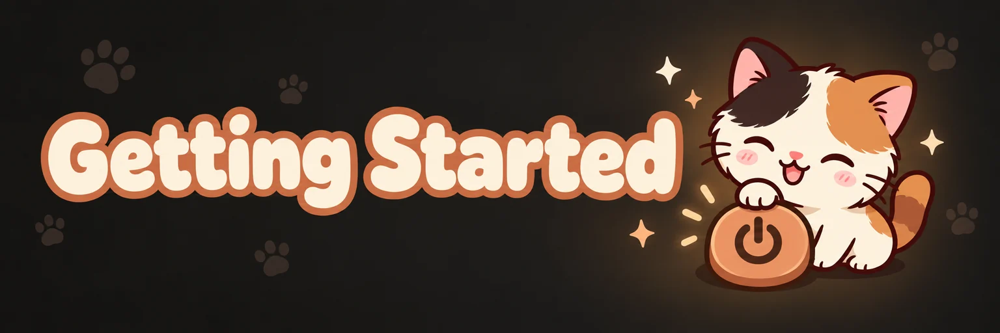
</p>

Pick whichever fits what you've got:

| You've got | Go with |
| --- | --- |
| An Android phone on Android 11 or newer | [The Android app](#android-app) |
| An older Android phone, or you like a terminal | [Termux](#android-with-termux) |
| Windows, macOS or Linux | [A computer install](#on-a-computer) |
| An iPhone | A computer install, then [open it on your phone](#opening-it-on-your-phone) |

Whichever you pick, you still need a model to talk to: an API key from a provider, or a local backend like KoboldCpp or Ollama.

### Android app

On Android 11 or newer, download the file ending in `-android-arm64.apk` from the [latest release](https://github.com/platberlitz/Neconyan/releases/latest) and open it. Android will probably ask you to allow installing apps from your browser first.

Everything runs on the phone, so there's no Termux or computer involved. Leave about 2 GiB free and give the first opening time to unpack. To update, install the new APK over the old one and your chats stay put. [Android setup, backups and build instructions.](../android/README.md)

### On a computer

1. **Get Neconyan.** There are two ways, and the second one keeps itself up to date.

   - **Download it.** Grab the file ending in `-source.zip` from the [latest release](https://github.com/platberlitz/Neconyan/releases/latest) and unzip it somewhere easy to find, like your Documents folder. On Windows, right-click the zip and choose **Extract All** first, because running the launcher from inside the zip won't work. You'll end up with a folder named after the version, like `Neconyan-1.1.0`.
   - **Clone it with [Git](https://git-scm.com/downloads).** Open a terminal where you want the folder and run the line below. The launcher then checks for a new version every time you start it and updates before opening, which is why I'd go this way.

     ```sh
     git clone https://github.com/platberlitz/Neconyan.git
     ```

2. **Start it.** Open the Neconyan folder and run the launcher for your system.

   | System | How |
   | --- | --- |
   | Windows | Double-click `Start.bat` |
   | macOS | Double-click `Start.command` |
   | Linux or WSL | Open a terminal in the folder and run `./start.sh` |

   The first start takes a few minutes. If you don't have Bun or Node.js (the programs that actually run Neconyan), the launcher installs Bun for you, then downloads everything else Neconyan needs. Keep that window open while you use Neconyan; closing it, or pressing Ctrl+C in it, stops Neconyan.

3. **Open it.** Your browser should open by itself. If it doesn't, go to **http://127.0.0.1:4433/**.
4. **Connect a model.** Click **Connections** in the sidebar, pick your provider and model, then paste your API key or your local backend's address. After that, import a character or say hi to Miso, Taro or Nori on Home.

Next time, run the same launcher again.

**Updating.** Git installs update themselves when you start them. For the zip, download the new one and unzip it into a new folder, close Neconyan, then copy the `data` folder from the old Neconyan folder into the new one, plus `config.yaml` if you changed it. Start the new one and check your chats are there before you delete the old folder.

### Android with Termux

[Termux](https://termux.dev/) is a terminal app for Android. It's more fiddly than the app above, but it works on older phones too.

1. Install Termux from [F-Droid](https://f-droid.org/packages/com.termux/) or [its GitHub releases](https://github.com/termux/termux-app/releases).
2. Open Termux and update it. If it stops to ask about a config file, press Enter to keep the current one.

   ```sh
   pkg update && pkg upgrade -y
   ```

3. Install Git, then download Neconyan into your Termux home. `--depth 1` skips the project's old history, so it's a smaller download, and updates still work.

   ```sh
   pkg install -y git
   ```

   ```sh
   git clone --depth 1 https://github.com/platberlitz/Neconyan.git ~/Neconyan
   ```

4. Start it. The first start installs Node.js and everything else Neconyan needs, so give it a few minutes.

   ```sh
   cd ~/Neconyan && bash start.sh
   ```

5. When you see `Go to: http://127.0.0.1:4433/ to open Neconyan`, open that address in Chrome or any other browser on the phone. Then connect a model from **Connections**, same as on a computer.

A few Termux habits worth picking up:

- Android likes to stop apps in the background. Pull down your notifications and tap **Acquire wakelock** on the Termux one, so Neconyan keeps running while you're in the browser.
- To stop Neconyan, tap **CTRL** on the row of extra keys, then **C**.
- Next time, open Termux and run `cd ~/Neconyan && bash start.sh` again. It updates itself before starting.
- Keep the folder in your Termux home. The launcher refuses to run from shared storage like `/sdcard`, because Android blocks the file links Neconyan's packages need there.
- In Chrome's menu, **Add to home screen** gives Neconyan its own icon.

### Opening it on your phone

If Neconyan runs on your computer, your phone can use it too, as long as both are on the same Wi-Fi. It's the only way to use it on an iPhone for now.

1. Stop Neconyan and open `config.yaml` in the Neconyan folder with any text editor. It appears after the first start. Change `listen: false` to `listen: true`.
2. While you're in there, turn on a password, because otherwise anyone on your Wi-Fi can open it. Set `basicAuthMode: true`, then change the `username` and `password` under `basicAuthUser`.
3. Start Neconyan again and find your computer's local address.
   - **Windows:** run `ipconfig` in Command Prompt and look for **IPv4 Address**.
   - **macOS:** hold Option and click the Wi-Fi icon in the menu bar, then look for **IP Address**.
   - **Linux:** run `hostname -I`.
4. On your phone's browser, type that address with `http://` in front and `:4433` after it, for example `http://192.168.1.20:4433`.

If Windows asks whether to let Bun or Node.js through the firewall, allow it on private networks. If your phone shows a page that just says **Forbidden**, your network hands out addresses starting with `10.`, which Neconyan blocks by default. Add this line under `whitelist:` in `config.yaml`, then restart Neconyan:

```yaml
  - 10.0.0.0/8
```

<details>
<summary><b>Picking Node.js or Bun, and other launcher options</b></summary>

Every system also has separate Node.js and Bun launchers, if you'd rather choose:

| System | Node.js | Bun |
| --- | --- | --- |
| Windows | `Start-Node.bat` | `Start-Bun.bat` |
| macOS | `Start-Node.command` | `Start-Bun.command` |
| Linux / WSL | `./start-node.sh` | `./start-bun.sh` |
| Android (Termux) | `bash start-termux-node.sh` | `bash start-termux-bun.sh` |

To install by hand, you need Node.js 20 or newer:

```sh
npm install
npm run start:node
```

Bun 1.3.14 or newer works too: run `bun install`, then `bun run start`, or `bun run start:mobile` to use less memory. Keep the repo's `.npmrc` file as it is.

To stop a Git install updating itself, set `NECONYAN_AUTO_UPDATE=0` before running the launcher.

</details>

<details>
<summary><b>If something won't start</b></summary>

- **Windows says it protected your PC:** click **More info**, then **Run anyway**. It says that about most downloaded launchers.
- **macOS won't open `Start.command` because it's from an unidentified developer:** right-click it and choose **Open**. On newer macOS versions, go to **System Settings → Privacy & Security** and click **Open Anyway** instead.
- **macOS or Linux says the launcher isn't executable:** run this in the Neconyan folder.

  ```sh
  chmod +x Start*.command start*.sh scripts/*.sh
  ```

- **A Git install stopped updating:** the launcher skips updates if you've edited any of Neconyan's own files, and says why when it starts. Your chats and `config.yaml` don't count.
- **Android:** Node.js is the default in Termux. Bun needs two extra packages first:

  ```sh
  pkg update && pkg install -y glibc-repo && pkg install -y glibc-runner
  ```

  Set `GLIBC_ROOT` if your glibc lives somewhere other than `$PREFIX/glibc`.

- **Port 4433 is taken:** pass `--port` with another number, or change the port in `config.yaml`.

</details>

### Coming from SillyTavern or SillyBunny?

Most of your characters, chats, lorebooks, personas and presets should come across fine, but I can't promise everything will, and extensions that rely on SillyTavern's page layout might need fixing.

- **Back up your old install first**, and keep that backup until you've checked everything works.
- **Give Neconyan its own data folder.** Never point two apps at the same one.

Neconyan makes its own `config.yaml` and `data/` folder the first time it runs. Your personal data, keys and installed packages are never part of the release.

<details>
<summary><b>For developers</b></summary>

`main` holds release snapshots and `staging` is where work happens. Use a separate checkout and data folder for testing, so your everyday chats stay out of it.

```sh
npm run lint
npm run build:frontend
npm run check:frontend-budgets
npm --prefix tests install
npm --prefix tests run test:unit
```

Browser tests live in `tests/` and run against a throwaway server: set `NECONYAN_TEST_BASE_URL` to its address (the default is `http://127.0.0.1:4433`). Build the frontend before testing, and restart the server after rebuilding. Temporary screenshots, test reports, build output and local runtime folders stay out of commits.

</details>

<p align="center">
  
</p>

Neconyan is built on the work of everyone behind SillyTavern and SillyBunny; none of this would exist without them. The bundled tools and the projects they came from are credited in [the included tools list](../docs/neconyan-native-tools.md).

Made by [Platberlitz](https://github.com/platberlitz). Licensed under [GNU AGPL v3](../LICENSE), so keep the notices and licences in place if you redistribute it.
